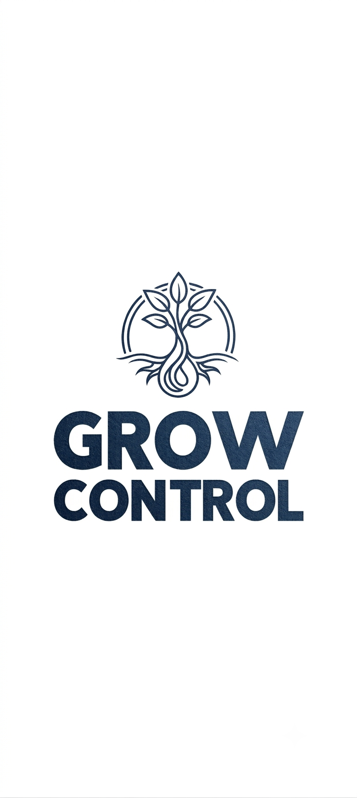

# GROWCTRL Cards

Dashboard-Karten im Design **„Soft Garden"** für die
[GROWCTRL-Integration](https://github.com/MrDarkvoid/growctrl) – aufeinander
abgestimmte Lovelace-Karten für hydroponische Growzelte in Home Assistant
(Leitprinzip: **eine Station = eine Pflanze**).

## Installation (HACS)

1. HACS → drei Punkte → **Benutzerdefinierte Repositories**.
2. `https://github.com/MrDarkvoid/growctrl-cards` als **Dashboard** hinzufügen.
3. „GROWCTRL Cards" installieren – die Ressource bindet HACS automatisch ein.

> Setzt die GROWCTRL-Integration voraus.

## Enthaltene Karten

Hero · Station · Checkup · Status/Protokoll · History · Metric · Tank · Controls · Sensors ·
Tent (kompakt). Alle integrations-nativ (Entity-IDs aus `tent`+`station` abgeleitet),
antippbare Werte (More-Info), per-Zelt-Akzent über `style.accent`, barrierearm.

Die **Station**-Karte führt mit zwei Dropdowns (Pflanze + Phase mit Tagzähler), zeigt die
Phasen-Empfehlung als Text und die Sensorwerte mit **pH/EC-Zonen-Balken aus dem Pflanzen-Preset**;
eine konfigurierte Germination-Heizung erscheint als Zeile mit integriertem Schalter (gesperrt bei
Gate/Automatik/Wartung). Das **Checkup** zeigt die **Sensor-Gesundheit** je Station (Idealbereiche
aus dem Preset) sowie Steuerung und Zelt – getrennt und mit Legende.

**Konfiguration mit Beispielen je Karte:**
[`cards/README.md` im Hauptprojekt](https://github.com/MrDarkvoid/growctrl/blob/main/cards/README.md).

## Design „Soft Garden"

Warmes Schwarzgrün, ein frei wählbarer Akzent je Zelt, themenunabhängige Status- und
Sonderfarben (z. B. Heizmatte orange, Befeuchter blau), Tabellenziffern, runde Formen,
weiche Schatten. Sprache automatisch Deutsch/Englisch nach Home-Assistant-Sprache.

## Lizenz

GROWCTRL Source-Available License (GC-SAL) 1.0 – siehe [`LICENSE`](LICENSE).
Privat & nicht-kommerziell frei mit Namensnennung „MrDarkvoid"; kommerzielle Nutzung,
Re-Hosting und modifizierte Veröffentlichungen nur mit schriftlicher Zustimmung.

*MrDarkvoid – Vibe Coding mit Claude (Anthropic).*
